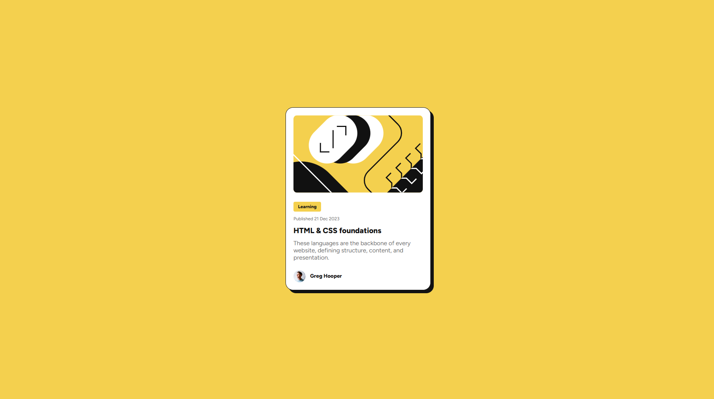

# Frontend Mentor - Blog preview card challenge solution
This is a solution to the [Blog preview card challenge on Frontend Mentor](https://www.frontendmentor.io/challenges/blog-preview-card-ckPaj01IcS).

## Table of contents

- [Overview](#overview)
  - [The challenge](#the-challenge)
  - [Screenshot](#screenshot)
  - [Links](#links)
- [My process](#my-process)
  - [Built with](#built-with)
  - [What I learned](#what-i-learned)


## Overview

### The challenge

Users should be able to:
- See hover and focus states for all interactive elements on the page

### Screenshot


### Links

- Solution URL: [Click here](https://github.com/AdyMIN509/blog-preview-card-main)
- Live Site URL: [Click here](https://adymin509.github.io/blog-preview-card-main/)


## My process

### Built with

- Semantic HTML5 markup
- Variable with css
- Flexbox
- Mobile-first workflow


### What I learned

I learned something new doing this project:

* The mobile first design approach.
* Using variable in css to easily change the formatting of the page:
	```css
	:root {
		--yellow: hsl(47, 88%, 63%);
		--white: hsl(0, 0%, 100%);
		--gray-500: hsl(0, 0%, 42%);
		--gray-950: hsl(0, 0%, 7%);
		--p-font-size: 1rem;
		--mobile-width: 375px;
		--desktop-width: 1440px;
		--weigth-500: 500;
		--weigth-800: 800;
		--shadow-color: #000000;
	}
	```
* Flexbox for the layout:
	```css
	main {
		background-color: var(--white);
		width: min(90%,327px);
		border-radius: 20px;
		padding: 20px;
		border: 1px solid var(--gray-950);
		box-shadow: 8px 8px var(--shadow-color);
		font-family: Figtree;
		display: flex;
		flex-direction: column;
		gap: 24px;
	}
	```